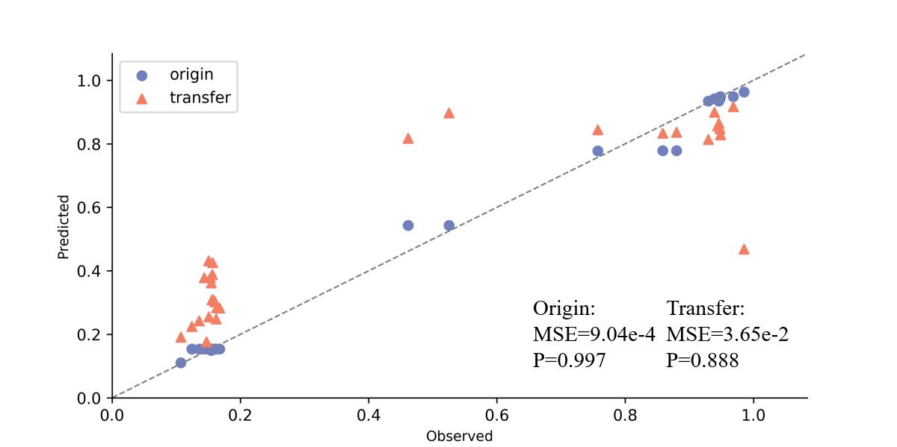
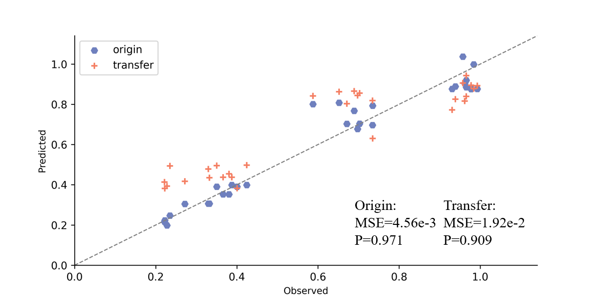

# EAST: An Efficient Knob Estimation System for Cloud Database


An interpretable database knob estimator model. 


# Table of contents

1. [Main Modules](#modules)
2. [Setup](#setup)
3. [Benchmark](#benchmark)
4. [Run](#run)
5. [Experiment](#experiment)

## Main Modules <a name="modules"></a>

| Module                    | Description                                                                                   |
|---------------------------|-----------------------------------------------------------------------------------------------|
| knob_tool                 | Knob management tools, including database restart, configuration update, etc.                 |
| knob_evaluator            | Model implementation and historical experience reuse.                                         |
| collect                   | Collect performance data.                                                                     |
| rank                      | Sort by Knob Importance data.                                                                 |
| main                      | Task startup and parameter parsing.                                                           |

## Setup <a name="setup"></a>

Set up a virtual environment and install according dependencies. 

```shell
conda create -n venv python=3.8
conda activate venv
pip install -r ./requirements.txt
```

During the experimental phase, we deploy databases using Docker containers and you need to fill in the necessary information in config.yaml before start it. 

example:
```shell
sudo -S docker run --name pg_test --privileged=true -m 4G --cpus 4 --device-write-bps /dev/sda:50MB --device-read-bps /dev/sda:50MB -d -e POSTGRES_PASSWORD=Secretpassword@123 -v /data/postgresql/pg_test:/var/lib/postgresql/data -u root -p 5432:5432 postgres
```

## Benchmark <a name="benchmark"></a>

We use the open-source database benchmarking tool [benchbase](https://github.com/cmu-db/benchbase) for database performance testing and data collection.

You need to download the repo and compile benchbase, then add the tool path into config.yaml

## Run <a name="run"></a>

```
usage: An Efficient Estimation System for the Knob Tuning under Dynamic Workload [-h] [--config [CONFIG]] [--collect] [--two_stage] [--rank] [--evaluate] [--train] [--save]

optional arguments:
  -h, --help            show this help message and exit
  --config [CONFIG], -c [CONFIG]
                        config file used to connect database and execute workload
  --collect             execute collect command
  --two_stage           collect performance data using two-stage strategy
  --rank                execute rank command
  --evaluate            evaluate knob performance for given config
  --train               train model for knob performance evaluation
  --save                save current experience into pool

Nice:)
```

An example for direct learning, containing the data collection, knob importance ranking and model training.

```shell
python ./__main__.py --config dbmind/components/knob_estimator/share/config.yaml --collect
python ./__main__.py --config dbmind/components/knob_estimator/share/config.yaml --rank
python ./__main__.py --config dbmind/components/knob_estimator/share/config.yaml --train
```

Also, EAST could implement the transfer learning to obtain the knob estimator from historical experiences. First remove the model_path in config.yaml and run the following command, the program will automatically reuse the history experience, and obtain the tuning recommendation from EAST.

```shell
python ./__main__.py --config dbmind/components/knob_estimator/share/config.yaml --evaluate
```

## Experiment <a name="experiment"></a>

Knob estimate accuracy is as follows:

### YCSB 



### TPCC 

